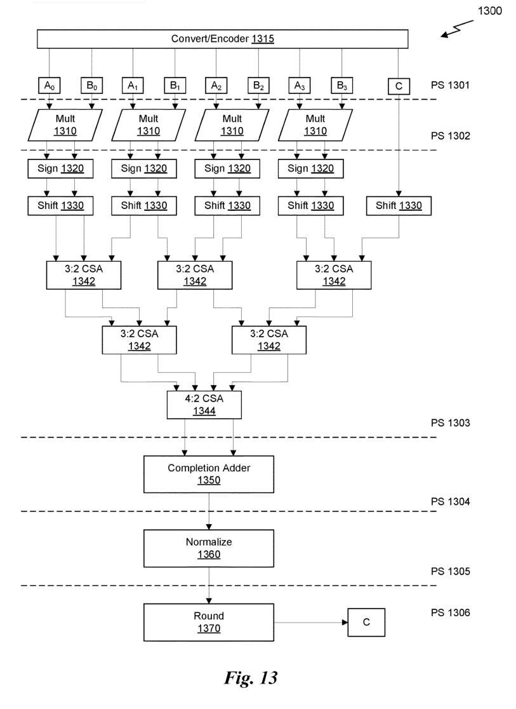
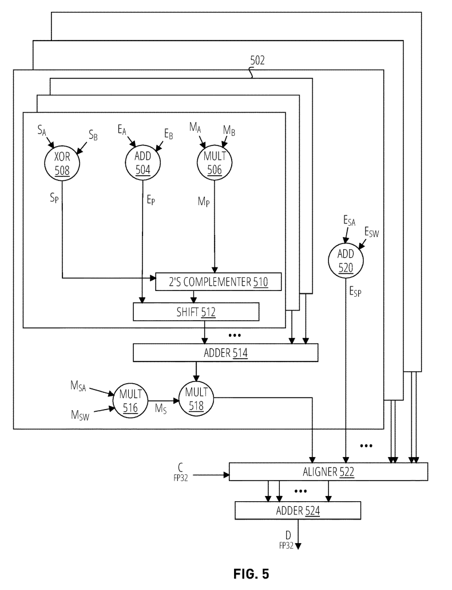

# tpu_demo
tpu_demo：模拟BF16下，1*16*1的乘加操作(K=16方向乘累加)，观察精度是否和NV MMA相当。

TPU大概步骤：
1、指数拉齐 （按照最大指数拉齐）
2、尾数相乘 & 对阶移位 （按照最大指数对阶移位，可能出现大数吃小数导致精度损失的情况）
3、华莱士加法树累加
4、规格化处理

其中，对阶移位后低位额外保留比特（EXTRA_BIT）由"mma_precision_test"测试后反推得到（NV MMA能容忍的最大指数差异为25，反推得到EXTRA_BIT=11）。

在-100.0~100.0范围内随机测试，比较设计TPU与NV MMA间ulp精度差异：
```
1) EXTRA_BIT = 10下，
test_ulp_bf16: my_ave_ulp=1.02078, nv_ave_ulp=0.71568; my_max_ulp=7424, nv_max_ulp=2048

2) EXTRA_BIT = 11下，
test_ulp_bf16: my_ave_ulp=0.57135, nv_ave_ulp=0.71568; my_max_ulp=6144, nv_max_ulp=2048

3) EXTRA_BIT = 12下，
test_ulp_bf16: my_ave_ulp=0.27614, nv_ave_ulp=0.71568; my_max_ulp=2048, nv_max_ulp=2048
```
说明：测试结果与反推结果吻合，当EXTRA_BIT=11时，设计TPU精度基本与NV MMA持平。

## NV相关专利参考
1. US12321743B2
给出了fp16相关TPU框架结构

2. US20240160406A1
给出了MXFP8、NVFP4（甚至更激进的LOG4）相关TPU框架结构

